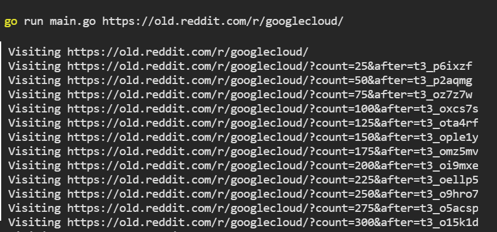

# Crawl Old Reddit

Execute this Project

```
go run main.go "your_url_about_old_reddit"
```

## Example
Visit Google Cloud on reddit 
```
go run main.go https://old.reddit.com/r/googlecloud/
```

Actual Page [visit](https://www.reddit.com/r/googlecloud/)

## Example running this code
